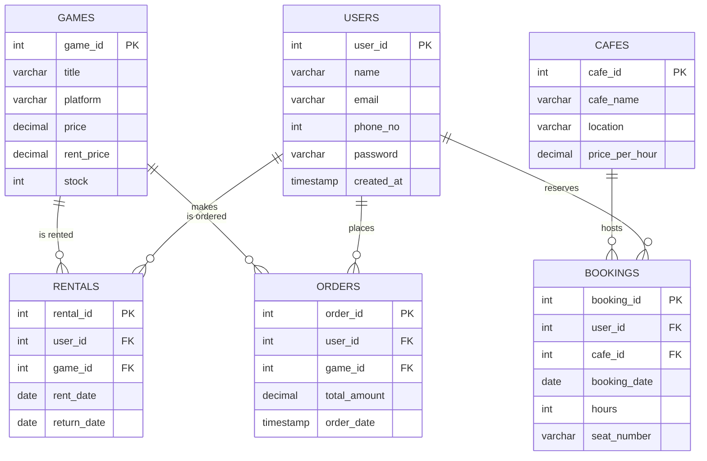

# 🎮 BOOKMYGAME - High-Tech Gaming Lounge & Game Rental Portal

Welcome to **BOOKMYGAME**, a premium cyberpunk-themed web platform for a modern Gaming Cafe network and Game store! This system allows users to explore premium gaming experiences, reserve physical PlayStation 5 / PC gaming slots across various cafes, rent or purchase CD copies of bestseller games, and view their personalized gaming dossiers.

---

## ✨ Features & Architecture

BOOKMYGAME brings together an outstanding front-end design and a robust, secure back-end database service:

### 1. 🌌 Immersive Cyberpunk UI
- **Rich Aesthetics & Dark Mode:** Designed with glassmorphic cards, deep purple and neon overlays, floating action widgets, and smooth micro-animations.
- **High-Tech Typography:** Styled using Google Fonts (`Oxanium`, `Russo One`, `Orbitron`, and `Share Tech Mono`) for that premium futuristic feel.
- **Responsive Navigation:** A state-of-the-art header with full user authentication states, search prompts, and a custom shopping cart toggle.
- **Cyber Quest Memory Match:** A fully interactive retro-cyberpunk match-two mini-game on the homepage. Succeeding in under 12 moves unlocks the exclusive loyalty voucher `JISHANT10`.

### 2. 💺 Interactive Seat Booking
- **Physical PS5 Lounge Reservation:** Users can pick dedicated seats ($S1$ through $S11$) at any of our three prime lounges:
  1. **Nexus Gaming Lounge** (Downtown Plaza, 4th Floor - featuring 120Hz Displays)
  2. **Vortex Esports Arena** (Tech Park Avenue, Gate 2 - featuring Pro Headsets)
  3. **Overdrive Play Zone** (Marina Boardwalk, Shop 10 - featuring Pro Racing Seats)
- **Real-Time Booking State:** The seat selection grid pulls occupied seats directly from the MySQL database and locks them dynamically.
- **Time Slots Modal:** Once a seat is selected, users can pick a custom 2-hour slot (e.g., `10:00 AM - 12:00 PM`) to finalize their booking.

### 3. 🛍️ Digital & CD Game Store
- **Browse & Buy:** Users can explore and purchase bestseller titles like *God of War Ragnarök*, *Resident Evil 4*, and *Assassin's Creed Valhalla*.
- **Rentals System:** Rent games directly for custom durations with automatically calculated return dates saved in the database.
- **Dynamic Shopping Cart Drawer:** A slide-out global cart that stores selected games, calculates local GST (18%), and processes checkout transactions in Indian Rupees (INR) with custom toast notifications.

### 4. 📇 User Portal & History Dossier
- **Secure Register & Sign In:** Validated web forms checking database integrity for credentials and existing accounts.
- **Interactive Profile page:** Displays user statistics and chronological logs of:
  - 🛒 **Purchases:** Order numbers, total spent, date of purchase, and game titles.
  - 🔑 **Rentals:** Rental records, checkout dates, and active return deadlines.
  - 🎮 **Seat Bookings:** Lounges visited, exact dates, reservation hours, and seat numbers.

---

## 🛠️ Technology Stack

| Layer | Technologies / Packages Used |
| :--- | :--- |
| **Frontend** | HTML5, Vanilla CSS3 (Custom Styles), Bootstrap v5.3, JavaScript (ES6+), Google Fonts |
| **Backend** | Node.js, Express.js (REST APIs) |
| **Database** | MySQL |
| **Middlewares & Drivers** | `mysql2` (Database pool driver), `cors` (Cross-Origin Resource Sharing), `body-parser` |

---

## 🗄️ Database Schema Design

The relational database schema is configured under the name `bookmygame` with referential integrity constraints:



---

## 🚀 Setup & Installation Instructions

Follow these steps to deploy and run **BOOKMYGAME** locally on your machine:

### Prerequisites
Make sure you have [Node.js](https://nodejs.org/) (v16+ recommended) and a [MySQL Server](https://www.mysql.com/) installed and running.

### Step 1: Database Setup
1. Open your MySQL Command Line or tool of choice (e.g. phpMyAdmin, DBeaver, MySQL Workbench).
2. Load and execute the SQL script file:
   ```sql
   SOURCE database.sql;
   ```
   *This automatically creates the `bookmygame` database and compiles the six fundamental tables (`users`, `games`, `rentals`, `orders`, `cafes`, and `bookings`).*

### Step 2: Connection Configuration
Open `db.js` in the project root directory and update your MySQL credentials to match your local database settings:
```javascript
const pool = mysql.createPool({
  host: "localhost",
  user: "root",           // Your MySQL Username
  password: "YOUR_PASSWORD",   // Your MySQL Password
  database: "bookmygame",
  waitForConnections: true,
  connectionLimit: 10,
  queueLimit: 0
});
```

### Step 3: Package Installation
Open a terminal in the project directory and install the necessary dependencies:
```bash
npm install
```

### Step 4: Run Migrations and Seed Data
Initialize the database with the pre-configured games catalog and cafe lounges priced in Indian Rupees (INR):
```bash
node seed.js
```

### Step 5: Start the Backend Server
Run the Express application server:
```bash
node server.js
```
The console will log `Server running on port 5000` upon a successful connection.

### Step 6: Launch the Frontend
Since the application uses absolute server routing (`http://localhost:5000/api/...`), you can launch the app directly:
- Open `index.html` inside any web browser, or use a local development server extension like *Live Server* in Visual Studio Code.
- Register a new account, play the Neon Memory Match game, purchase games via the checkout cart, and book seats dynamically!

---

## 📁 Repository Structure

```
├── CSS/
│   └── STYLES.CSS          # Premium custom cyberpunk styling, gradients, & custom scrollbars
├── Pictures/               # Media resources, graphics, and background assets
├── bg-video.mp4            # Ambient full-screen looping backdrop video
├── index.html              # Homepage with Hero Slider, Online Stats, & Cyber Match Game
├── booking.html            # PS5 Cafe seat selector & live slot-booking module
├── games.html              # Digital game list, prices, renting modals, & cart handlers
├── profile.html            # Chronological user transaction logs, statistics, & profile settings
├── register.html           # Authentication portal for new gamers
├── signin.html             # Secure login for registered profiles
├── contact.html            # Customer service support desk & contact forms
├── db.js                   # MySQL database connection pool setup
├── database.sql            # Core SQL schema template
├── seed.js                 # Seeding & alter migrations script (INR configuration)
├── server.js               # Node/Express API routes, middleware, and backend server
├── package.json            # Node.js project meta & npm dependencies
└── README.md               # User manual & developer guide (This file)
```

---

## 💡 Developer Notes
- **Authentication Guard:** Direct views like `booking.html` and `profile.html` have a built-in strict authentication guard. Trying to access these pages before logging in redirects the user immediately to `register.html` with a descriptive query notification.
- **Decimal Precision:** Financial prices are formatted in standard Indian currency commas (`₹` with `toLocaleString('en-IN')`) for professional display.
